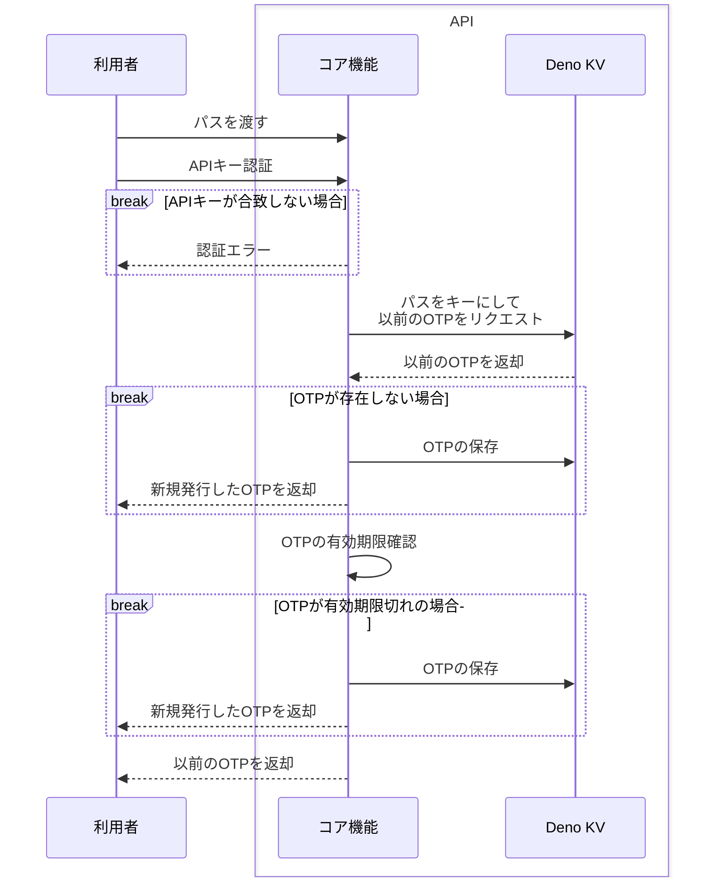

この記事は、Deno Advent Calendar 2023の23日目です。
https://qiita.com/advent-calendar/2023/deno

## 作り始めた動機
私は記事を限定公開するときに環境変数に書いて、それが外部から入力されたときに通す形にしていました。  
しかしこれでは、一度その内容を知ってしまえば限定公開になりませんし、何よりいちいち手動で環境変数を書き換えるのは面倒です。

そこで、「期間限定にするなら、いわゆるOTPのような感じにすればよいのでは？」と思い、期間限定の文字列を返すAPIとそれを閲覧するデスクトップアプリを作ることにしました。

## 忙しい人向け
- [Deno KV](https://deno.com/kv)の`expireIn`を使うことで一定期間で自動削除されるパスワードができる
- 各サービスごとにエンドポイントを切ることで、複数のサイトやページに対応できる
- Deno KVはリモートのKVも取れるので、GETのエンドポイントを設けなくてもデータが取れる
- [webview_deno](https://github.com/webview/webview_deno)を使えば、デスクトップアプリも作れる
- Denoを入れるだけですぐに使えるDeno KVはお手軽でいいぞ！！

APIはザックリとシーケンス図を書いていたので御覧ください。シンプルです。


## OTP配信APIの作成
このAPIはPOSTリクエストでOTPを取得し、クエリパラメータなどで外部から取得したOTPと突合するために利用します。
OTPの保存にはDeno KVを利用します。
https://deno.com/kv

### Deno KVとは
JavaScript/TypeScriptランタイムであるDenoに組み込まれたKey-Value型のデータベースです。  
Deno CLIでは[SQLite](https://www.sqlite.org/index.html)、Deno Deployでは[FoundationDB](https://www.foundationdb.org)が使われています。

最近になってセルフホスト版がリリースされ、npmモジュールもリリースされました。
https://github.com/denoland/denokv
https://www.npmjs.com/package/@deno/kv
Deno KVがDenoにロックインしない、というのは興味深いです。
興味がある方は、Node.jsやそれ以外のプロジェクトで試してみてください。

### OTPの生成
OTPの生成にあたって、どのようなOTPにするか考えました。
今回はGoogle Authenticatorなどで使われる数字のみにしてみようと思い、`crypto.getRandomValues`を使用しています。ランダムな文字列であれば`crypto.randomUUID`でも良いかもしれません。  
`crypto.getRandomValues`で生成したランダムな数字の配列の中から、さらにランダムなIndexで数値を取り出して使う、という形式です。
https://github.com/windchime-yk/pseudo-otp-generator/blob/57b8532bad73d59e67fa5c1ec7a868e6e4b6f819/api/core.ts#L28-L37

### OTPの保存
OTPの保存は、OTPの取得や更新と合わせて行います。
まず、全体像が以下になります。
https://github.com/windchime-yk/pseudo-otp-generator/blob/57b8532bad73d59e67fa5c1ec7a868e6e4b6f819/api/core.ts#L60-L94

まずはDeno KV上のOTPの取得と新規OTPの生成を行ないます。
https://github.com/windchime-yk/pseudo-otp-generator/blob/57b8532bad73d59e67fa5c1ec7a868e6e4b6f819/api/core.ts#L65-L66

その後、以前のOTPが空っぽか有効期限切れであれば新規のOTPを保存します。
https://github.com/windchime-yk/pseudo-otp-generator/blob/57b8532bad73d59e67fa5c1ec7a868e6e4b6f819/api/core.ts#L68-L85
有効期限切れの判定関数には標準ライブラリの`difference`を使い、現在日時との差分を出しています。
https://deno.land/std@0.210.0/datetime/difference.ts?s=difference
Denoは標準ライブラリが非常に豊富で、眺めてみると「これもあるの！？」という驚きがあるので是非使ってみてください。

あとは以前のOTPが新規のOTPと被っていないか確認し、そこも問題なければ以前のOTPを返します。

### REST APIの作成
API作成にはHonoを利用します。
https://github.com/honojs/hono

この部分は特筆したことをやっていないのと、そこまで量がないので、全てのコードを貼って終わりにしようと思います。  
`/otp/`の後ろに自由にパスを設定して、そのパスをキーにしてDeno KVに保存する仕組みです。デフォルトで1日保存され、クエリパラメータでの指定で保存時間を延長することができます。
https://github.com/windchime-yk/pseudo-otp-generator/blob/57b8532bad73d59e67fa5c1ec7a868e6e4b6f819/api/main.ts
Honoの簡潔さにはいつも助けられています。

## OTP表示アプリの作成
配信するAPIを作成したので、次は表示するアプリを作成します。  
アプリ作成には、webview_denoというサードパーティのモジュールを利用します。  
https://github.com/webview/webview_deno  
各OSのWebviewを使って表示しているので、Chromiumが同梱されているElectronより軽量なはずですが、表示に差異が出るようです。

今回はメイン機のWindowsで使うので、Windowsでのコンパイルを目指します。

### リモートのKVと接続
当初はGETリクエストで取得しようと思ったのですが、Deno KVには引数にリモートのKV URLを設定するとリモートのKVと繋ぐことができるので、今回はそれを利用してみます。
https://docs.deno.com/kv/manual/on_deploy#connect-to-managed-databases-from-outside-of-deno-deploy

Deno DeployのProjectsページのKVタブを覗くと、以下のようなセクションがあるはずです。

この中の`https://api.deno.com/`から始まるURLを`Deno.openKv()`の引数にしてください。

なお、これを利用するにはアクセストークンの発行が必要になります。
[アカウント設定ページ](https://dash.deno.com/account#access-tokens)の中に、アクセストークンのセクションがあるはずです。

これは実装には書かず、環境変数に`DENO_KV_ACCESS_TOKEN`と記述するだけで読み取られます。

### UIの作成
webview_denoでアプリ部分を書き、PreactやTwindでUI部分を書いています。
webview_denoにはいくつかUIの書き方があるのですが、今回は開発時にWebサイトとして表示させたかったため、Web Workerとして読み込みアプリ内部でlocalhostを読みに行く形式です。

当初、Preactを使うにあたって`deno.jsonc`の`compilerOptions`にPreactの設定を書いて、各ファイルの`/** @jsx h */`を省略しようと思っていました。
ただ、現状だとcompileコマンドで読み込まれずエラーになるので、妥協して省略せずに書いています。
https://github.com/denoland/deno/issues/20532

また、TwindはTwind Intellisenseが上手く動きません。私の場合は`twind.config.ts`を作成しても動きませんでした。
https://github.com/tw-in-js/vscode-twind-intellisense/issues/12
これの回避方法としては身も蓋もないのですが、空っぽの`tailwind.config.ts`を作成することで[Tailwind CSS Intellisense](https://marketplace.visualstudio.com/items?itemName=bradlc.vscode-tailwindcss)を動かせます。TwindがTailwind CSSと互換性があるからできることですね。
https://github.com/denoland/fresh/issues/1519#issuecomment-1650161356

UI部分はあまり作り込んでいないので、引っかかるところはそれほどありませんでした。
最後に単一実行可能アプリケーションとしてコンパイルします。

### デスクトップアプリとしてコンパイル
Denoにはcompileコマンドというものがあり、例えばWindows端末からmacOS向け単一実行可能アプリケーションをコンパイルするなど、端末に左右されないコンパイルをすることができます。
https://docs.deno.com/runtime/manual/tools/compiler

向き先を指定するには`--target`をコマンド実行時に指定する必要があり、Windowsは`x86_64-pc-windows-msvc`と書くことで指定できます。
```bash
deno compile --target x86_64-pc-windows-msvc ./app/main.ts
```
今回はUIをWeb Workerとして指定していたり、現状だとunstableのDeno KVを利用するので、以下のようになります。
```bash
deno compile --unstable --target x86_64-pc-windows-msvc --include ./app/worker.tsx ./app/main.ts
```
ここに`--allow-*`や`--deny-*`など認可系フラグが入りますが、大筋はこのようになるはずです。

#### Windowsのターミナル表示について
Windows向けのコンパイルだと、デフォルトでアプリの背後にターミナルが表示されます。  
これに対して、[v1.36.0](https://github.com/denoland/deno/releases/tag/v1.36.0)で`--no-terminal`が追加されたのですが、現状上手いこと動きません。
https://github.com/denoland/deno/issues/21091

現状の結論としては、妥協してターミナルを表示させたままにするか、macOSでコンパイルするかの2択になるのかな、と思っています。
詳しくは別記事に書いたので、よければ御覧ください。
https://zenn.dev/windchime_yk/articles/deno-compile-no-terminal-bug

## 最後に
Deno KVはいいぞ！ あとあまり使われてなさそうな機能はIssueが見つかりやすいから報告してみよう！ という感じのツール制作記事でした。
次回はuki00aさんの『Denoのまとめ (2023)』です！
